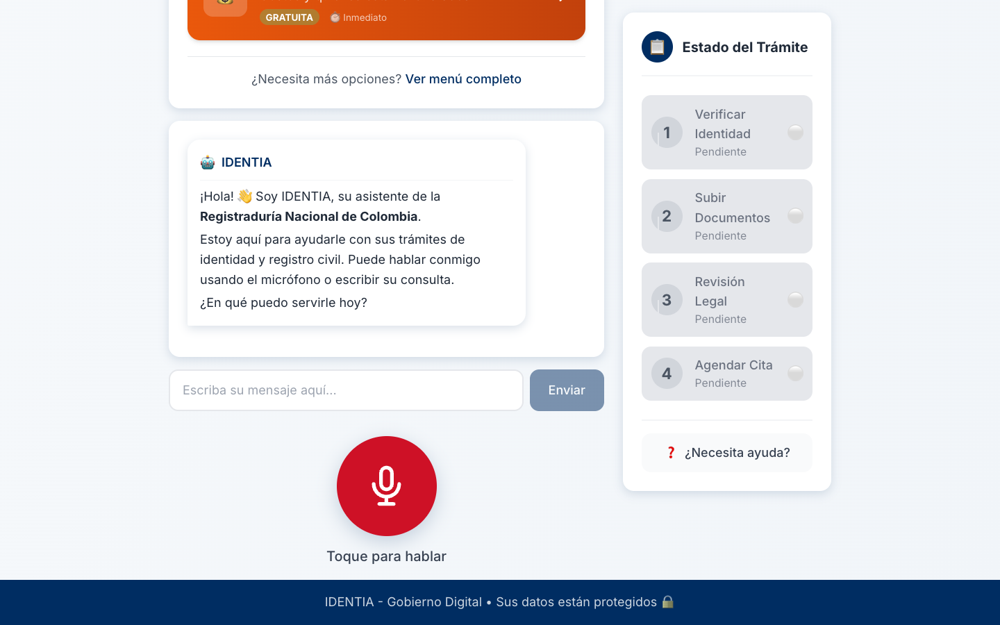

<div align="center">
  

  # 🪪 IDENTIA v1.5
  ### Ecosistema de Identidad y Asistencia Ciudadana con IA

  [](https://reactjs.org/)
  [](https://vitejs.dev/)
  [](https://tailwindcss.com/)
  [](https://www.python.org/)
  [](LICENSE)

  <p align="center">
    <b>IDENTIA</b> revoluciona la interacción ciudadano-estado mediante un asistente inteligente capaz de ver, escuchar y guiar.
    <br />
    Diseñado con un enfoque <i>"accessibility-first"</i> para adultos mayores y ciudadanos digitales.
  </p>
</div>

---

## 🚀 Novedades de la Versión 1.5

### 🧭 Sistema de Navegación Universal
Nueva barra de herramientas flotante que permite un flujo de usuario intuitivo:
- **Botón Home:** Regreso inmediato al panel de servicios.
- **Botón Volver:** Historial de navegación inteligente.
- **Feedback Auditivo:** Sonidos de interacción para mejorar la accesibilidad.

### 📊 Línea de Tiempo de Trámites (StatusView)
Visualización clara y transparente del progreso de tus documentos:
- Rastreo en tiempo real mediante PIN único.
- Indicadores visuales de estado (Pendiente, En Proceso, Completado).
- Integración con notificaciones de voz.

### 💍 Módulo de Registro Civil de Matrimonio
Nuevo flujo especializado para la gestión de nupcias:
- **Voice Handler Específico:** Reconocimiento de números de registro por voz.
- Validaciones automáticas de formato.
- Guía paso a paso con el asistente virtual.

---

## ✨ Características Principales

| Característica | Descripción |
|----------------|-------------|
| 🤖 **IA Conversacional** | Asistente empático impulsado por LLMs que entiende el contexto y detecta intenciones. |
| 🎤 **Reconocimiento de Voz** | Entrada natural por voz Web Speech API, optimizada para acentos locales. |
| 🔐 **Biometría Avanzada** | Verificación de identidad facial y vocal sin contraseñas complejas. |
| 📷 **Escaneo Inteligente** | OCR en tiempo real para digitalizar documentos físicos al instante. |
| ♿ **Accesibilidad Total** | UI de alto contraste, textos grandes y navegación simplificada. |

---

## 🛠️ Stack Tecnológico

### Frontend
- **React 18** + **Vite**: Rendimiento ultrarrápido.
- **Tailwind CSS**: Diseño moderno y responsivo.
- **Framer Motion**: Animaciones fluidas para una experiencia premium.
- **Web Speech API**: Reconocimiento y síntesis de voz nativos.

### Backend (Próximamente v2.0)
- **FastAPI**: API REST de alto rendimiento.
- **LangChain/LangGraph**: Orquestación de agentes de IA.
- **Tesseract / Azure AI**: Procesamiento de documentos.

---

## 📸 Galería

<div align="center">
  
  <p><i>Panel principal con servicios accesibles y asistente virtual siempre disponible.</i></p>
</div>

---

## 🚀 Instalación y Despliegue

### Requisitos Previos
- Node.js 18+
- npm o yarn

### Pasos Rápidos

1. **Clonar el repositorio**
   ```bash
   git clone https://github.com/JhonHTipas21/IDENTIA.git
   cd IDENTIA/frontend
   ```

2. **Instalar dependencias**
   ```bash
   npm install
   ```

3. **Iniciar el servidor de desarrollo**
   ```bash
   npm run dev
   ```

4. **Abrir en el navegador**
   Visita `http://localhost:5173` para interactuar con IDENTIA.

---

## 🤝 Contribución

¡Las contribuciones son bienvenidas! Por favor, abre un issue o envía un pull request para mejoras.

## 📄 Licencia

Este proyecto está distribuido bajo la licencia **MIT**.

---

<div align="center">
  <sub>Desarrollado con ❤️ por Jhon Harvey Tipas Solis</sub>
</div>
